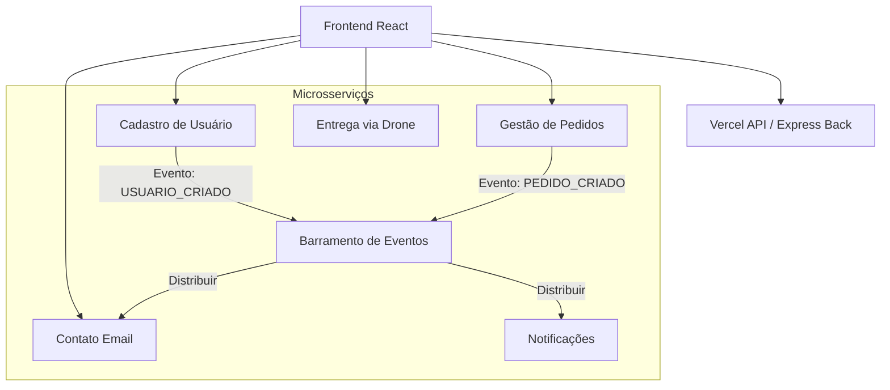

---
Integrantes:
- Arthur Gama Ruiz (RA: 23.01445-8)
- Enzo Oliveira D’Onofrio (RA: 23.01561-6)
- Felipe Fazio da Costa (RA: 23.00055-4)
- João Vitor Morimoto Sesma (RA: 23.01516-0)
- Leonardo Souza Olivieri (RA: 23.01512-8)
- Pedro Wilian Palumbo Bevilacqua (RA: 23.01307-9)

Data: 04/06/2026
Matérias: 
- ECM516_Arquitetura_de_Computadores
- ECM252_Linguagens_de_Programação_2
---

# Documentação SkySwift - Entrega via Drones

## 1. Visão Geral
O SkySwift é uma plataforma de entrega autônoma via drones, composta por uma arquitetura de microsserviços que permite a gestão de usuários, pedidos, rastreamento em tempo real e comunicações.

## 2. Arquitetura do Sistema

A arquitetura é baseada em microsserviços que se comunicam de forma assíncrona através de um **Barramento de Eventos**.

---

## 3. Detalhamento por Pasta e Código

### 3.1. Back-end (`/back` e `/api`)
O projeto possui duas implementações de backend: uma baseada em Express (`/back`) para execução local e outra adaptada para Vercel Serverless Functions (`/api`).

#### 3.1.1. Barramento de Eventos (`/back/barramento_eventos`)
*   **`server.js`**: Implementa um servidor Express que atua como hub central.
    *   `POST /inscricao`: Permite que outros microsserviços se inscrevam para receber eventos.
    *   `POST /eventos`: Recebe um evento e o distribui para todos os serviços inscritos (exceto a origem).
*   **`_utils.js` (API)**: Funções auxiliares para manipulação de requisições serverless.

#### 3.1.2. Cadastro de Usuário (`/back/cadastro_usuario`)
*   **`server.js`**: Gerencia autenticação e perfil.
    *   Utiliza **MySQL** para persistência.
    *   **JWT** para autenticação de sessões.
    *   **Bcrypt** para hashing de senhas.
    *   Publica eventos como `USUARIO_CRIADO` ao barramento.

#### 3.1.3. Gestão de Pedidos (`/back/gestao_de_pedidos`)
*   **`server.js`**: Ponto de entrada que carrega as rotas.
*   **`routes/pedidos.js`**: Define os endpoints CRUD para pedidos.
*   **`middleware/validarPedido.js`**: Valida a estrutura dos dados de um pedido antes do processamento.

#### 3.1.4. Entrega via Drone (`/back/entrega_via_drone`)
*   **`server.js`**: Provê lógica de roteamento.
    *   `GET /rota`: Simula/Calcula a rota entre dois pontos geográficos para o drone.

#### 3.1.5. Contato Email (`/back/contato_email`)
*   **`server.js`**: Integração com **Nodemailer**.
    *   Escuta eventos do barramento ou recebe requisições diretas para envio de confirmações e mensagens de suporte.

#### 3.1.6. Notificações (`/back/notificacoes`)
*   **`server.js`**: Gerencia o histórico de notificações do usuário.
    *   Consome eventos do barramento para gerar alertas em tempo real.

---

### 3.2. Front-end (`/front`)
Desenvolvido em **React** com **Vite** e **Bootstrap**.

#### 3.2.1. Estrutura Principal
*   **`App.jsx`**: Orquestrador principal. Gerencia o roteamento customizado, estado de autenticação global e o tema (Light/Dark).
*   **`main.jsx`**: Ponto de entrada do React.

#### 3.2.2. Páginas e Componentes
*   **`PedidoPage.jsx`**: Interface completa para criação e acompanhamento de pedidos.
*   **`DroneTrackingSection.jsx`**: Painel de rastreamento com mapa (simulado) mostrando a posição do drone.
*   **`AccountPage.jsx`**: Gestão de perfil do usuário (edição de dados, troca de senha, exclusão).
*   **`LoginPage.jsx`**: Formulários de login e cadastro.
*   **`NotificacoesPage.jsx`**: Central de alertas do usuário.
*   **`TopBar.jsx`**: Barra de navegação com indicadores de estado e alternador de tema.
*   **`Hero.jsx` / `Advantages.jsx`**: Componentes da Landing Page.

#### 3.2.3. Serviços
*   **`pedidosEntregaService.js`**: Encapsula as chamadas de API para o microsserviço de pedidos.
*   **`notificacoesService.js`**: Gerencia a busca e marcação de lido das notificações.

---

## 4. Banco de Dados
O sistema utiliza **MySQL** (principalmente no cadastro) e **SQLite** (nas funções serverless da Vercel para persistência rápida).

*   **`deploy_cloud.sql`**: Script de criação das tabelas no ambiente de produção.
*   **`back/banco/script.sql`**: Script para ambiente local.

---

## 5. Fluxo de Funcionamento (Exemplo: Novo Pedido)
1.  O usuário preenche o formulário em `PedidoPage.jsx`.
2.  O frontend chama o microsserviço `gestao_de_pedidos`.
3.  `gestao_de_pedidos` salva o pedido e envia um evento `PEDIDO_CRIADO` ao `barramento_eventos`.
4.  O `barramento_eventos` repassa o evento para `notificacoes` e `contato_email`.
5.  O usuário recebe uma notificação na interface e um e-mail de confirmação.
