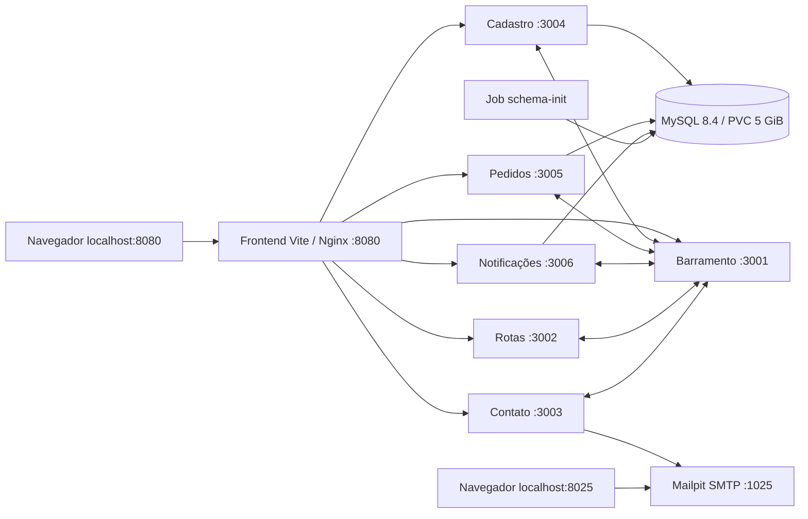

# SkySwift no Kubernetes local

O ambiente executa o frontend, os seis serviços Node.js, MySQL e Mailpit no Kubernetes do Docker Desktop. Os recursos ficam exclusivamente no contexto `docker-desktop`, namespace `skyswift`. A Vercel continua independente.

## Preparação e execução

Instale Node.js 24, npm, Docker Desktop e `kubectl`. No Docker Desktop, crie ou habilite o cluster Kubernetes com provisionador **kind**, **um nó** e armazenamento de imagens **containerd**. O modo kind exige containerd, conforme a [documentação do Docker Desktop](https://docs.docker.com/desktop/use-desktop/kubernetes/). O ambiente foi validado com 8 GiB disponíveis para o Docker.

Na raiz do repositório:

```bash
npm ci
npm ci --prefix front
npm run k8s:check
npm run k8s:up
npm run k8s:access
```

Mantenha o último comando aberto. A aplicação fica em <http://localhost:8080> e a caixa de e-mails em <http://localhost:8025>. Todos os encaminhamentos escutam apenas em `127.0.0.1`; `Ctrl+C` os encerra. É possível escolher outras portas: `APP_PORT=8081 MAIL_PORT=8026 npm run k8s:access`.

Os scripts usam o Docker `desktop-linux` e passam `--context docker-desktop` explicitamente ao `kubectl`. Para evitar configurações de clusters externos em `KUBECONFIG`, leem por padrão `$HOME/.kube/config`. Se o contexto local estiver em outro arquivo, use `SKYSWIFT_KUBECONFIG=/caminho/config npm run k8s:check`. O contexto ativo do usuário não é alterado.

## Comandos

| Comando | Resultado |
| --- | --- |
| `npm run k8s:check` | Confere Docker, contexto, nó pronto e renderização Kustomize |
| `npm run k8s:build` | Constrói e carrega sete imagens para a arquitetura do Docker |
| `npm run k8s:up` | Constrói imagens, aplica infraestrutura, esquema e aplicação e espera os rollouts |
| `npm run k8s:up -- --no-build` | Reutiliza a última tag local, conferindo existência e arquitetura das imagens |
| `npm run k8s:access` | Encaminha aplicação e Mailpit para localhost |
| `npm run k8s:status` | Exibe workloads, pods, Services, PVC, Jobs e eventos |
| `npm run k8s:logs -- gestao-de-pedidos` | Acompanha logs do componente escolhido; também aceita `mysql`, `mailpit` e `frontend` |
| `npm run k8s:test` | Testa APIs pelo Nginx, SMTP e recuperação após reinícios |
| `npm run k8s:test -- --skip-recovery` | Executa os fluxos HTTP sem reiniciar componentes |
| `npm run k8s:test -- --lifecycle` | Reaplica a subida duas vezes e testa parada/subida com dados persistidos |
| `npm run test:vercel` | Executa os seis handlers serverless localmente contra MySQL e SMTP de testes |
| `npm test` | Testa rota normal e alternativa usando provedores HTTP simulados |
| `npm run k8s:down` | Para workloads e preserva namespace, Services, PVC e Secrets |
| `npm run k8s:down -- --purge-data` | Exclui o namespace, o PVC, credenciais e referência local de imagens |

Os testes usam dados sintéticos e removem seus registros ao concluir. Testes de recuperação e ciclo interrompem componentes temporariamente. Os encaminhamentos de `k8s:access` são vinculados aos pods: após substituir frontend/Mailpit ou executar parada/subida, execute o comando novamente. As portas de testes HTTP são 18080/18025; os testes Vercel usam MySQL 13307 e SMTP 11025.

Para verificar AMD64 em uma máquina ARM64 sem trocar a tag usada pela subida:

```bash
PLATFORM=linux/amd64 SAVE_TAG=false npm run k8s:build
```

## Arquitetura



Cada componente tem uma réplica. Os Services são internos (`ClusterIP`), com DNS em hífens (`gestao-de-pedidos`). As APIs e nomes inscritos preservam os sublinhados (`gestao_de_pedidos`). Por exemplo, `/api/gestao_de_pedidos/pedidos?status=rascunho` chega a `http://gestao-de-pedidos:3005/pedidos?status=rascunho`. O proxy conserva métodos, corpo, parâmetros e cabeçalho Bearer. Rotas de páginas usam fallback da SPA; APIs desconhecidas retornam JSON 404 e falhas de conexão do proxy retornam JSON 503.

Os manifests são organizados em `infra/kubernetes/infrastructure` e `infra/kubernetes/application`, usando o [Kustomize integrado ao kubectl](https://kubernetes.io/docs/tasks/manage-kubernetes-objects/kustomization/). `schema-job.yaml` é aplicado separadamente para aguardar a conclusão antes dos serviços. Os Dockerfiles Node usam contexto `back/`, necessário para copiar `back/shared/runtime.js`; o frontend usa contexto `front/`.

## Banco, configuração e credenciais

MySQL 8.4 executa como StatefulSet, com PVC `data-mysql-0` de 5 GiB e StorageClass padrão do Docker Desktop. O usuário `skyswift` utiliza somente o banco `skyswift`. O Job aplica `deploy_cloud.sql` com `CREATE TABLE IF NOT EXISTS`, criando usuários, pedidos, notificações e inscrições. Reaplicar o esquema não remove registros. Alterações futuras em tabelas existentes precisarão de migrações próprias.

O `ConfigMap` `skyswift-config` fornece DNS, portas e parâmetros. Na primeira subida, senhas MySQL e segredo JWT aleatórios são gerados em `.kubernetes-local/secrets.env` com permissão restrita e enviados ao Secret `skyswift-secrets`. Esse diretório é ignorado pelo Git. Subidas seguintes reutilizam o Secret e o arquivo local; imagens excluem arquivos `.env`. Preserve as credenciais ao preservar o PVC. A exclusão de dados exige `--purge-data`.

Pedidos agora são persistidos em MySQL, com UUID, preços, tempos e histórico no contrato HTTP anterior. Atualizações de status usam transações e `SELECT ... FOR UPDATE`. Eventos `RotaCalculada` aceitam `pedidoId` opcional, atualizam somente pedidos confirmados/em processamento e ignoram repetições e estados terminais. Entregues e cancelados não podem ser reativados. O frontend revalida os IDs de pedidos guardados no navegador pela API, remove referências inexistentes e exibe erros de comunicação.

## Saúde e recuperação

Os serviços mantêm `/health` e acrescentam `/live` e `/ready`. `/live` verifica o processo; `/ready` verifica inscrição recente no barramento e, para cadastro/pedidos/notificações, a tabela necessária no banco. As [probes de startup, liveness e readiness](https://kubernetes.io/docs/tasks/configure-pod-container/configure-liveness-readiness-startup-probes/) distinguem processo vivo de dependências disponíveis. `SIGTERM` interrompe inscrições, drena HTTP e fecha os pools com prazo de encerramento.

Os cinco consumidores renovam a inscrição após cada intervalo de cinco segundos, sem sobreposição, com timeout de dois segundos. Reiniciar o barramento apaga suas listas em memória; os consumidores recuperam as inscrições automaticamente. A entrega tolera duas novas tentativas curtas em caso de conexão recusada. Rollout pronto pode anteceder brevemente a propagação dos endpoints no nó; os testes aguardam recuperação estável antes de publicar novos pedidos.

O barramento mantém até 1.000 eventos em memória. Não há fila durável, outbox ou garantia de reenvio durante indisponibilidade: um pedido pode ser gravado sem que sua notificação seja entregue se o barramento estiver indisponível. Notificações são globais, conforme o contrato anterior. O ambiente é para desenvolvimento e demonstração local.

## E-mail, mapa e Vercel

O [Mailpit](https://mailpit.axllent.org/docs/install/docker/) captura SMTP dentro do cluster. `SMTP_AUTH_REQUIRED=false` habilita explicitamente SMTP sem autenticação nesse ambiente; o padrão fora dele exige autenticação. `SMTP_FROM` e `CONTACT_RECIPIENT` usam endereços `example.test`. Contatos enviados pela interface podem ser conferidos na caixa local. Receber eventos de pedido no contato apenas registra o evento: não há e-mail automático de confirmação de pedidos.

O mapa depende de geocodificação e imagens externas. A rota tenta provedores OSRM e oferece alternativa quando estão indisponíveis. `ROUTING_PROVIDERS` permite usar provedores HTTP simulados nos testes; a alternativa preserva `pedidoId` no evento.

`vercel.json` usa `npm ci` na raiz e no frontend. As funções `api/` permanecem separadas dos processos `back/` e agora aguardam a publicação de eventos antes de responder. A inscrição serverless usa SQL MySQL com atualização idempotente. Para deploy completo na Vercel, aplique `deploy_cloud.sql` em MySQL externo, configure `DB_HOST`, `DB_PORT`, `DB_USER`, `DB_PASSWORD`, `DB_NAME`, `JWT_SECRET`, `BARRAMENTO_URL` (URL pública terminada em `/api/barramento_eventos`) e SMTP autenticado externo. Cadastre as URLs públicas de pedidos e notificações em `POST /api/barramento_eventos/inscricao` ou na tabela `inscricoes`. SQLite é somente um mock local e não oferece persistência confiável em funções serverless. Nesta entrega a Vercel foi validada localmente, sem publicação.

## Diagnóstico

Se faltar o contexto `docker-desktop`, habilite o cluster e confira o arquivo indicado por `SKYSWIFT_KUBECONFIG`. Se houver `ImagePullBackOff`, confira containerd no Docker Desktop e reconstrua as imagens com `k8s:build`; `k8s:up --no-build` usa a tag em `.kubernetes-local/image-tag`, não a tag estática `local` dos manifests. Os rollouts confirmam que as imagens carregadas estão disponíveis aos pods.

Se o esquema falhar, use `k8s:status` e consulte `kubectl --kubeconfig "$HOME/.kube/config" --context docker-desktop -n skyswift logs job/schema-init`. Para banco, use `npm run k8s:logs -- mysql`. Se uma porta estiver ocupada, escolha `APP_PORT`/`MAIL_PORT` ou encerre o encaminhamento anterior. Não remova o PVC para resolver problemas de conexão.

Resultados concretos da execução estão em [kubernetes-testes.md](kubernetes-testes.md).
